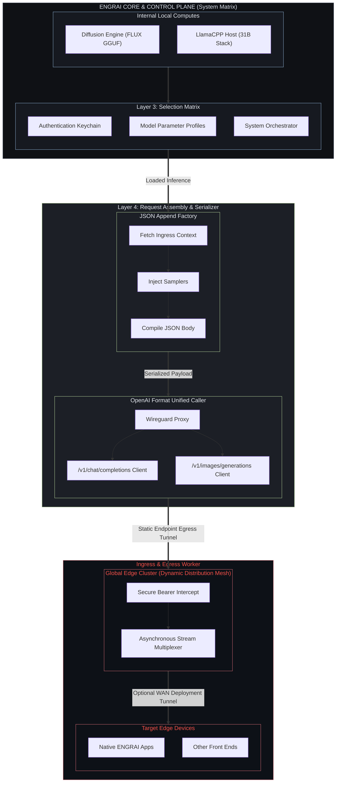

# ENGRAISERVER

**Simplify local LLM accessibility.** ENGRAISERVER runs your local models and
connects them to the ENGRAI client apps. Installing and using it should feel
like using an app—not setting up a development environment.

ENGRAI SERVER is a sovereign host control plane and runtime orchestrator for
Unix-like GPU workstations. It owns model identity, deployment policy, engine
lifecycle, API payloads, authentication, and the network boundary used by the
ENGRAI client family.

It does not wrap another inference product. The gateway directly owns pinned,
ENGRAI-built runtimes: `llama.cpp` for text and `stable-diffusion.cpp` for
images.
Engines run behind ENGRAI-owned typed contracts and stay bound to loopback or
private IPC. Clients never send engine flags.

> **Development status:** direct text (llama.cpp) and image
> (stable-diffusion.cpp) execution are integrated. Long-context burn-in,
> cancellation, and crash-recovery qualification remain release gates.

## Quick start

With ENGRAISERVER installed, open a terminal in any directory:

```bash
engrai-server init   # first-time setup
engrai-server serve
```

Open **http://127.0.0.1:8400** on the server and create your administrator
account. On subsequent launches, just run `engrai-server serve`. No `uv run`,
environment activation, or source-directory path belongs in everyday use.
The installed app keeps its configuration and models outside the source tree.

**Installation availability:** this is still a source-stage preview. A public
app installer and ready-to-download ENGRAI runtime bundles are not yet
provided. The anywhere-on-your-system CLI already works after installation;
the zero-toolchain installation experience is still a release requirement,
not a feature we claim to have shipped. Early testers can use the separate
[source installation guide](docs/SOURCE-INSTALL.md).

Generation needs a compatible ENGRAI runtime and model files. The product
requirement is for ENGRAISERVER to supply or acquire verified runtimes without
asking users to compile engines. Current manual runtime setup is documented
for developers in [RUNTIMES.md](docs/RUNTIMES.md).

See [Running ENGRAISERVER](docs/INSTALL.md) for models, client connections,
background operation, and troubleshooting.

## Documentation

- [Running ENGRAISERVER](docs/INSTALL.md): everyday commands, models, and services.
- [Source installation](docs/SOURCE-INSTALL.md): temporary preview setup for early testers.
- [Contributing](docs/CONTRIBUTING.md): tests, UI development, and packaging.
- [Containers and Kubernetes](deploy/CONTAINERS.md): build and deploy your own image.
- [Public release preparation](docs/PUBLIC-RELEASE.md): local review and first publication.
- [Architecture details](docs/ARCHITECTURE.md), [runtime policy](docs/RUNTIMES.md),
  [text deployments](docs/LLM-PROFILES.md), and [image deployments](docs/DIFFUSION-MODELS.md).

## Architecture

The diagram below sketches the broader product direction, including planned
SymLink and edge-distribution layers. A current installation is one gateway
supervising local workers; it does not deploy an edge cluster or configure a
WireGuard network. See [ARCHITECTURE.md](docs/ARCHITECTURE.md) for the implemented
contracts and planned work.


WireGuard provides the intended encrypted private-network transport. ENGRAI
SymLink is the planned application protocol above it for device identity,
capability negotiation, model operations, event streaming, and transfers.
Engine-native HTTP surfaces are not public interfaces.

## Repository layout

| Path | Responsibility |
| --- | --- |
| `@models/` | Portable manifests and versioned schemas; no host paths or GPU assignments |
| `src/engrai_server/domain/` | Engine-independent model and deployment contracts |
| `src/engrai_server/engines/` | Engine protocol and provider adapters |
| `src/engrai_server/` | Gateway, CLI, services, authentication, and orchestration |
| `src/engrai_server/static/` | Compiled presentation layer shipped in the wheel |
| `ui/` | Presentation source only |
| `tests/` | Domain, lifecycle, API, packaging, and UI tests |

The data flow is intentionally one-way:

```text
@models manifest
    → XDG-local deployment profile
    → engine adapter
    → executable launch specification
```

Portable manifests identify immutable artifacts and capabilities. Local
deployment profiles contain resolved paths, backend choice, devices, memory
policy, and tuning for one workstation. Engine arguments are compiled output.

## Host filesystem contract

Mutable data never belongs in the checkout or installed Python package.

| Kind | Default |
| --- | --- |
| Configuration and deployments | `${XDG_CONFIG_HOME:-~/.config}/engrai-server/` |
| Versioned ENGRAI runtime bundles and resolved artifacts | `${XDG_DATA_HOME:-~/.local/share}/engrai-server/` |
| Credentials, logs, and process state | `${XDG_STATE_HOME:-~/.local/state}/engrai-server/` |
| Disposable cache | `${XDG_CACHE_HOME:-~/.cache}/engrai-server/` |
| Hugging Face model cache | `${HF_HUB_CACHE:-${HF_HOME:-~/.cache/huggingface}/hub}` |

`ENGRAI_HOME` provides an explicit portable-layout override.

## Development

Contributor tooling is separate from the installed-app experience. See
[CONTRIBUTING.md](docs/CONTRIBUTING.md) for checkout setup, rebuilding local
changes, UI watch mode, tests, and packaging. Use
[SOURCE-INSTALL.md](docs/SOURCE-INSTALL.md) to install a source-preview build
as an independent app command.

Native engine compilation and qualification belong to
[RUNTIMES.md](docs/RUNTIMES.md). They are maintainer workflows, not something
users should need to learn to run local models.

## Run as a background service (Linux)

`engrai-server serve` stops when the terminal or SSH session that started it
closes, for example when the laptop you connected from goes to sleep. For an
always-on host, stop the foreground gateway with Ctrl+C first, then install
the systemd user service once using the installed app:

```bash
engrai-server service install --now
loginctl enable-linger "$USER"
```

The first command writes `~/.config/systemd/user/engrai-server.service`,
enables it at boot, and starts it now. The second keeps your user services
running when nobody is logged in; it is needed once per machine.

Everyday control:

```bash
engrai-server service status
engrai-server service restart
engrai-server service stop
journalctl --user -u engrai-server -f
```

The service reads `~/.config/engrai-server/gateway.env`; restart it after
editing that file. The unit points at the `engrai-server` executable of the
checkout or tool install that ran `service install`, so run it again after
moving the checkout or switching installs.

macOS can run the same CLI in the foreground or under an external supervisor;
native launchd integration is not implemented yet.

## Containers and Kubernetes

The repository includes one multi-stage `Containerfile`, a loopback-only
Compose example, and pod-first Kubernetes manifests. CPU and NVIDIA CUDA
images share the same recipe and bake both pinned native runtime bundles into
the image. See [deploy/CONTAINERS.md](deploy/CONTAINERS.md) for builds,
persistent volumes, GPU scheduling, first-run setup, and deployment commands.

## Security boundary

- The fresh default binds ENGRAI to `127.0.0.1:8400`.
- Engine workers remain loopback-only and are never the client contract.
- Credentials are stored with mode `0600` under XDG state.
- ENGRAI terminates only process groups it created.
- Model manifests cannot encode secrets, absolute paths, or device topology.
- Runtime installation is explicit, checksums every payload file, and uses an
  atomic active-runtime record; automatic replacement while requests are
  running is forbidden.

See [SECURITY.md](SECURITY.md) for reporting and operational guidance.

## Routes and deployments

Models can be downloaded from Hugging Face in the web UI without installing
the `hf` CLI. Search for a GGUF repository, select a quantization/variant,
review its size, and confirm. Split files are grouped; downloading all variants
is an explicit option, never the default. GGUF discovery does not certify
engine compatibility and excludes auxiliary projectors. Manual repository,
revision, and file filters remain under Advanced for other artifact layouts.
ENGRAI pins the resolved commit, checks free space, and writes only to
`ENGRAI_MODEL_DOWNLOAD_DIR`. Set a scoped read-only `HF_TOKEN` in the server environment for
private or gated repositories—the token is never handled by the browser.

Downloaded or existing models are added as routes in the web UI. Each route (the `model` value clients send) is
a model file plus its prompt policy, stored under the XDG config `routes/`
directory; its typed deployment (devices, context, KV cache, generation
defaults) is stored beside it under `deployments/`. Neither is ever packaged
or seeded. See [docs/LLM-PROFILES.md](docs/LLM-PROFILES.md) and
[docs/RUNTIMES.md](docs/RUNTIMES.md).

## Project status and licensing

Copyright © 2026 ENGRAISERVER. All rights reserved.

ENGRAI SERVER is pre-release software, licensed under the GNU Affero General
Public License v3.0. See [LICENSE.md](LICENSE.md). Bundled and pinned
third-party components keep their own licenses; see
[docs/ACKNOWLEDGEMENTS.md](docs/ACKNOWLEDGEMENTS.md).

[Support](mailto:support@engrai.app) ·
[ENGRAI Discord](https://discord.gg/TVB6nHKuN)
