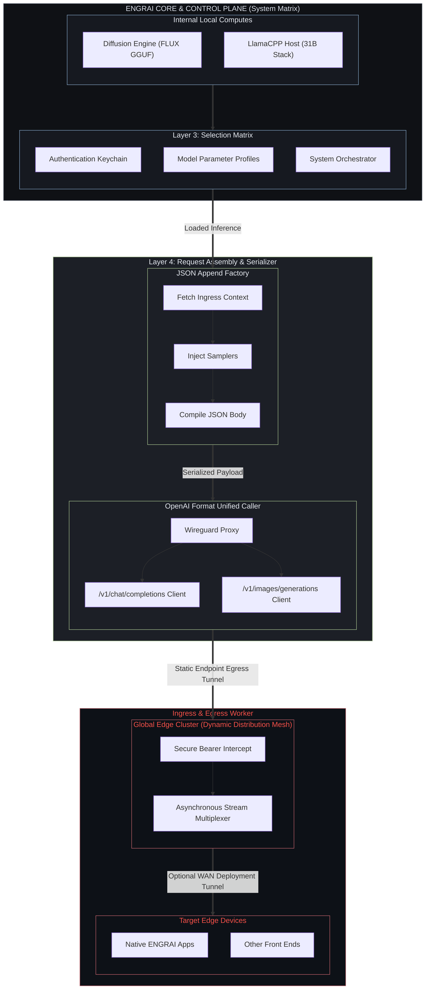

# Architecture

ENGRAI SERVER is the trusted host daemon between client devices and local
compute. The product owns the stable contract; numerical engines are replaceable
providers below it.

## Layers

This diagram is a product-direction sketch. The current implementation is a
single gateway with local worker processes; SymLink and the depicted global
edge-distribution layer are planned. Network tunnels are operator-managed
infrastructure, not provisioned by the gateway. Installation does not require
those planned layers.

WireGuard is transport infrastructure, not the application protocol. SymLink
will run above it and carry ENGRAI device identity, capability negotiation,
typed operations, state, event streams, and transfers. Upstream engine APIs are
never reachable by client devices.

## Sources of truth

| Concern | Source |
| --- | --- |
| Portable model identity | `@models/catalog/*.json` |
| Model-manifest contract | `@models/schemas/model-manifest.schema.json` |
| One host's deployment choices | XDG config `engrai-server/deployments/` |
| Engine capability and argument mapping | `src/engrai_server/engines/` |
| API and orchestration | `src/engrai_server/` |
| Presentation source | `ui/` |
| Shipped presentation | `src/engrai_server/static/` |

The repository never treats an executable command as model identity. A model
manifest is resolved to verified local artifacts, combined with a local typed
deployment, and compiled by an engine adapter into a launch specification.

## Runtime invariants

1. ENGRAI is the only client-reachable host service.
2. Engine workers bind only to loopback or private IPC.
3. ENGRAI owns worker process groups and terminates only those it created.
4. Model switching and generation are serialized where an engine requires it.
5. Portable manifests contain no absolute paths, secrets, or device topology.
6. Host tuning lives in ignored XDG configuration.
7. The UI edits typed domain values; raw provider flags are an advanced
   compatibility escape hatch, never the canonical record.
8. Runtime updates are explicit, pinned, checksummed, and never replace an
   executable serving an active request.
9. A clean clone is sufficient to reproduce the Python package and compiled UI.
10. A launch contains no unresolved placement choices: provider, devices,
    layer count, split, context, and cache policy are concrete before spawn.
11. Provider auto-fit is disabled. Failure is observable and repeatable rather
    than hidden behind an engine-selected reduction in context or offload.
12. Requested flags and effective model capabilities are different records.
    Architecture-specific limitations discovered at load are observable.

## Engines and routes

The text gateway launches the verified ENGRAI llama.cpp runtime through
`LlamaCppControlPlane`. A route records a model file and prompt policy; its
typed llama.cpp deployment is compiled into the launch. Routes are created in
the web UI and are never seeded or packaged. The image lane launches the
separately pinned stable-diffusion.cpp runtime (`engrai-image`); there is no
third-party fallback engine.

## Chat completions

`/v1/chat/completions` is rendered by the gateway, not by llama-server's chat
handler (`src/engrai_server/engines/llamacpp/chat.py`). Roleplay clients send
trailing assistant prefills, post-history `system` turns, and consecutive
same-role messages. llama-server's handler rewrites prefills around the
model's think markers and rejects or reorders unusual role sequences, which
corrupts multi-turn output differently for each client. The gateway instead:

1. renders `messages` with the model's own template, read from the worker's
   `/props` (the GGUF's `tokenizer.chat_template` unless the deployment
   overrides it), treating template `raise_exception` calls as no-ops;
2. appends a non-blank trailing assistant message verbatim as a prefill;
3. generates through `/completion` with `cache_prompt`, so an identical render
   of earlier turns keeps the worker's prompt cache warm;
4. splits known think markers into `reasoning_content` and returns standard
   chat completion objects or chunks, including the worker's `timings`.

Thinking follows the deployment's prompt policy (`enable_thinking`) and
reasoning effort; request `chat_template_kwargs` override both. Requests with
tools, non-text content parts, `n > 1`, or `logprobs` stay on llama-server's
native handler, which parses them. Every other `/v1/*` path is proxied as-is.

## Platform contract

The core is POSIX-oriented and targets Linux and macOS. Platform integration
is deliberately outside the engine protocol:

- Linux: CLI plus generated systemd user unit.
- macOS: CLI foreground operation today; launchd integration is planned.
- Accelerators: detected and expressed as capabilities rather than hard-coded
  product assumptions (CUDA, ROCm, Metal, Vulkan, or CPU).

## Deliberate non-goals

- Forking every upstream numerical kernel.
- Exposing provider-native HTTP APIs or bundled UIs.
- Encoding workstation paths or GPU layout in the model catalog.
- Letting frontend code define engine flags, model schemas, or orchestration.
- Making containers mandatory; containers are an optional deployment boundary.
