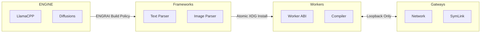

# Runtime policy

This document is for engine developers and release maintainers. ENGRAISERVER
must supply or acquire compatible verified runtimes for end users; compiling
engines is not the intended installation experience. During the source-stage
preview, bundles are installed manually and public downloads are not yet
provided. For everyday use, see [INSTALL.md](INSTALL.md).

ENGRAI owns the engine lifecycle, build provenance, network boundary, process
arguments, and observable behavior. llama.cpp (text) and stable-diffusion.cpp
(images) supply the MIT-licensed numerical kernels; neither is the
product-level runtime contract.

## Framework-like ownership

Each engine's full commit is recorded in `runtime/<engine>.lock.json`, and
`scripts/fetch-engine-sources.py` fetches exactly that revision into
`third_party/<engine>`. Sources are never vendored or tracked as Git
submodules. The build refuses any other revision. This is the Unix equivalent
of an app-owned framework:



Compiled blobs do not belong in Git. Linux and macOS release artifacts are
built from the same source lock; until bundles are published, build locally
using the developer workflow below. Every bundle includes the
worker, upstream license, source lock, build switches, and SHA-256 for every
payload file.

The initial worker executable is the minimal llama.cpp server target, renamed
and packaged as `engrai-text-worker`. It is built statically with the upstream
UI, prebuilt UI fetch, TLS listener, examples, tests, and unified app disabled.
ENGRAI alone owns the public UI and public network interface. The manifest
preserves the llama.cpp name, repository, tag, commit, and MIT license; product
ownership never means hiding kernel provenance.

## Build matrix

GPU agnostic means a common typed contract, not one magical binary containing
mutually incompatible vendor toolchains.

| Bundle backend | Hosts | Build switch | External host dependency |
| --- | --- | --- | --- |
| `metal` | macOS Apple Silicon | `GGML_METAL=ON`, embedded Metal library | macOS GPU stack |
| `cuda` | Linux NVIDIA | `GGML_CUDA=ON`, static CUDA runtime/cuBLAS | compatible NVIDIA driver (`libcuda`) |
| `rocm` | Linux AMD | `GGML_HIP=ON` | compatible ROCm stack |
| `vulkan` | Linux/macOS where qualified | `GGML_VULKAN=ON` | Vulkan loader/driver |
| `cpu` | Linux/macOS | accelerator backends disabled | operating-system C/C++ runtime |

Public release builds use `GGML_NATIVE=OFF` for CPU portability. A private
host build may opt into `--native`, and that fact is recorded in its bundle
manifest. Accelerator architecture restrictions are also explicit recorded
CMake inputs rather than invisible workstation assumptions.

## Installation and activation

Build prerequisites: Git, CMake, a C/C++ compiler, and Make or Ninja. On macOS,
the Xcode Command Line Tools provide the compiler. Accelerated builds also
need the backend's development toolchain, not just its host driver. These
are build-machine requirements, not requirements for running a release bundle.

For a first CPU text build, from a checkout prepared with `uv sync --frozen`:

```bash
uv run python scripts/fetch-engine-sources.py llama.cpp
uv run python scripts/build-runtime.py --engine llama.cpp --backend cpu --jobs 4
```

For an optional CPU image runtime, replace `llama.cpp` with
`stable-diffusion.cpp` in both commands. Text does not need the image runtime.
Builds can take substantial time and disk space; lower `--jobs` if compilation
exhausts memory. Build commands print the exact archive path under
`dist/runtime/`. Building a runtime does not download model weights.

From the checkout root, fetch the pinned sources and build each runtime.
This CUDA example requires its development toolchain; use `cpu` without an
accelerator toolchain or select the backend in the table above:

```bash
uv run python scripts/fetch-engine-sources.py
uv run python scripts/build-runtime.py --engine llama.cpp --backend cuda
uv run python scripts/build-runtime.py --engine stable-diffusion.cpp --backend cuda
```

Without an architecture option, CUDA builds use upstream's default, portable
architecture list, which is what release bundles should ship. A local build
can compile only for the GPUs actually installed, which is much faster, by
passing their compute capabilities, for example
`--cmake-option='-DCMAKE_CUDA_ARCHITECTURES=86;89'`.

Install the resulting directory or deterministic `.tar.gz`:

Stop active workers before replacing their runtime.

```bash
uv run engrai-server runtime install /path/to/bundle.tar.gz
uv run engrai-server runtime status                  # text
uv run engrai-server runtime status --runtime image  # image
```

Replace the placeholder with the exact archive printed by the build. A
standalone CLI installation can omit `uv run`. Text and image runtimes are activated independently
(`runtimes/<runtime>/active.json`).

The installer rejects wrong OS/architecture bundles, path traversal, links,
undeclared files, missing files, byte-size drift, checksum drift, an unknown
worker ABI, and runtime IDs other than `engrai-text` or `engrai-image`. It stages verification
under the runtime root, installs into:

```text
${XDG_DATA_HOME:-~/.local/share}/engrai-server/runtimes/
  <runtime-id>/<runtime-version>/<os>-<arch>-<backend>/
```

and atomically writes `active.json`. It never executes an unverified binary to
discover what it might be.

## ENGRAI worker contract

An ENGRAI worker is the normalization boundary around llama.cpp. It is not an
upstream web UI and not a bag of user-supplied flags. The direct implementation
is split into four pieces:

1. The runtime installer selects a verified app-owned bundle.
2. `inventory.py` asks that exact worker which devices it can use.
3. `adapter.py` compiles a resolved typed deployment into deterministic
   process arguments. It rejects auto-fit, ambiguous devices, public binds,
   and provider arguments that override ENGRAI policy.
4. `worker.py` owns the process group, loopback endpoint, private state,
   readiness deadline, log tail, and TERM-to-KILL shutdown sequence.

The compiler enables prompt caching, requests context shift and chunk reuse,
and exposes metrics and one or more slots. Those are requested capabilities,
not promises: hybrid architectures may reject some cache operations. ENGRAI
keeps exact-prefix slot caching distinct from arbitrary cache shifting and
reports the effective behavior observed after model load. For unequal GPUs,
device order and tensor split are typed launch inputs; llama.cpp is not allowed
to silently alter them after launch.

Model metadata is authoritative for architecture parameters. ENGRAI does not
invent RoPE overrides, and provider auto-fit is disabled. The planner may
choose a backend, device set, and VRAM-weighted tensor split for unresolved
local values, then persists the resolved plan before serving requests.

### Gemma 4 qualification note

Gemma 4 combines global and sliding-window attention. With the pinned
llama.cpp v0.5.0 worker, KV shifting and chunk-level `cache_reuse` are not
available for this context, but the persistent server slot still performs
exact longest-common-prefix reuse. A two-turn qualification retained all 2,716
tokens from the first prompt and evaluated only the 16 appended tokens on the
second request. This is the behavior required by an append-only chat client;
editing earlier turns or crossing the hard context boundary requires an
explicit ENGRAI history policy and may trigger full prefill.

## Qualification gate

A source lock and successful build establish provenance, not correctness. A
deployment is not qualified until automated burn-in verifies:

- the requested device order, tensor split, layer offload, context, and KV
  type from startup telemetry;
- prompt growth beyond the previous failure point and near context capacity;
- prefix-cache reuse and invalidation after editing an earlier message;
- streaming, reasoning, tool calls, cancellation, and timeout behavior;
- bounded VRAM/RAM headroom without engine-selected policy mutation;
- clean restart and recovery after a worker crash.

The gateway uses `LlamaCppControlPlane` and `ManagedWorker` for text. A CUDA
qualification run loaded a 31B model split across two GPUs of unequal VRAM,
returned an OpenAI chat completion, and shut down cleanly. Long-window
burn-in, cancellation, crash recovery, and architecture-specific capability
reporting remain release gates rather than assumptions.
